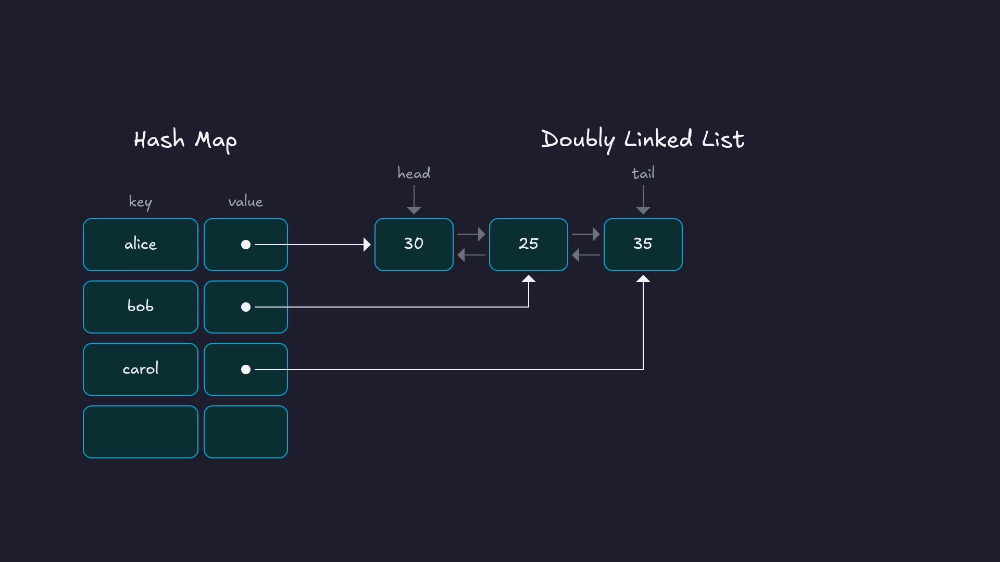
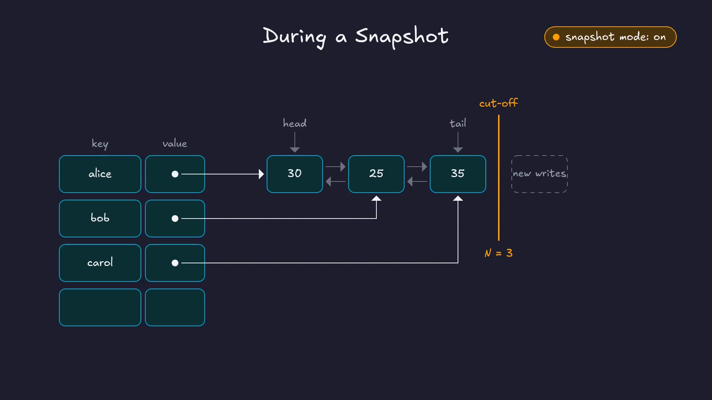
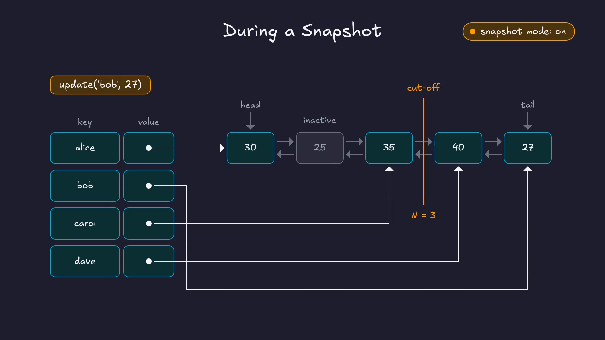
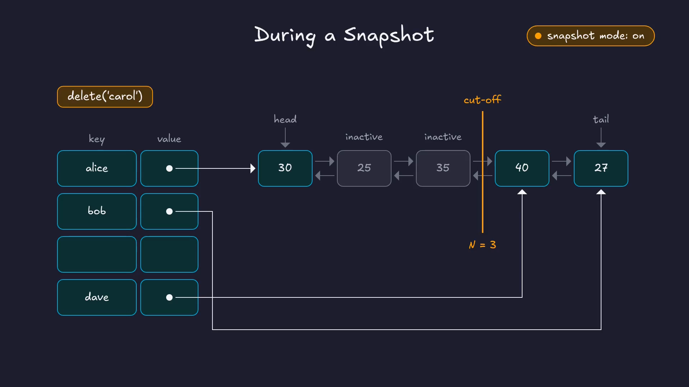
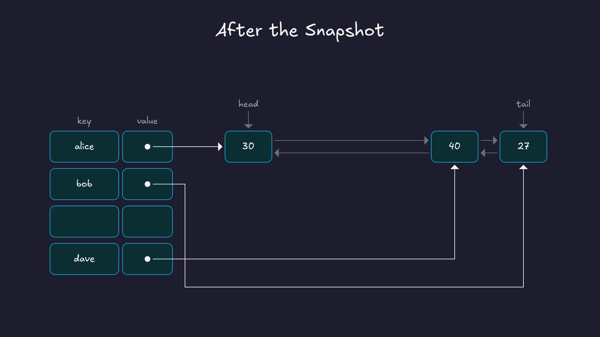

Let's say we have an in-memory database, and it's serving thousands of writes per second. How do we save a consistent snapshot of it to disk, without locking the whole database while we do it?

Redis famously solves this at the OS level, using the `fork()` system call and copy-on-write virtual memory pages. ClickHouse Keeper does it completely in user space. It takes non-blocking snapshots using two simple data structures: a doubly linked list and a hash map. In this post, we'll look at how that works, and then find it in the ClickHouse source code.

Prefer video? Here's the same walkthrough:



---

### Why the simple approaches don't work

There are two brute-force ways to take a snapshot, and neither really works for us:

1. **Hold a global lock while writing to disk.** Every client write waits until the snapshot is done, which could take seconds.
2. **Deep-copy the whole map in memory**, and let a background thread write the copy to disk. Now we're using double the memory. And usually only a small fraction of the keys change while the snapshot is being written, so most of that copying is wasted.

So what ClickHouse Keeper needs is a data structure with three properties:

1. Constant-time lookups, for the clients reading the data.
2. No locking, or if that's not possible, locking only for a very short time.
3. Copy-on-write only for the keys that change. That way, the extra memory we use is proportional to the number of writes during the snapshot.

---

### Why not a plain hash map?

The obvious question is: why can't we do this with a regular hash map, like `std::unordered_map` in C++?

The problem is that as writes keep arriving during a snapshot, the hash map will eventually need to grow and **rehash**. Rehashing moves keys into different buckets, so the order of the keys gets scrambled. If the snapshot thread is walking through the buckets while that happens, it can miss some keys and write others twice.

We need a structure that gives us constant-time lookups, but also a stable, predictable order to walk through.

---

### A hash map and a doubly linked list

To get both, we can combine two data structures we already know:

1. A **hash map** for constant-time lookups.
2. A **doubly linked list** that keeps a stable insertion order.

The key-value data actually lives in the nodes of the linked list. The hash map stores the keys, and each key's value is a pointer to that key's node in the list.

{fig-alt="A hash map with keys alice, bob and carol, each pointing to a node in a doubly linked list holding 30, 25 and 35."}

Let's look at how this behaves in two cases: during normal operation, when no snapshot is running, and while a snapshot is being taken.

#### Normal operation

When there's no snapshot running, everything is straightforward, and every operation is O(1):

- **Insert `dave`:** look up `dave` in the hash map. It isn't there, so append a new node at the tail of the list, and store a pointer to it in the hash map.
- **Update `dave` to 45:** look up `dave`, follow the pointer to its node, and change the value in place.
- **Delete `bob`:** look up `bob`, unlink its node from the list, and remove the key from the hash map.

#### During a snapshot

Here's the idea. The snapshot thread starts at the head of the list and walks it node by node, writing each node to disk, without holding any lock. At the moment the snapshot starts, the list has some fixed number of nodes. Let's call it **N**. We can think of this as a **cut-off line**.

If we can guarantee that every write that arrives after the snapshot starts only ever touches the list *after* this cut-off line, the snapshot thread can safely walk the first N nodes while writes carry on.

To start a snapshot, we record N and turn on a "snapshot mode" flag. Both must happen together, so we take a lock for that tiny moment, record the two values, and release it. Reads and writes are blocked only for those few instructions.

{fig-alt="Snapshot mode is on. A cut-off line is drawn after the third node, N = 3. New writes go after the line."}

Now the operations behave like this:

- **Insert:** nothing changes. New nodes are always appended at the tail, which is after the cut-off line anyway.
- **Update:** if the node is *before* the cut-off line, we can't change it, because the snapshot thread may not have written it yet. So we mark the old node as **inactive**, append a copy with the new value at the tail, and point the hash map at the copy. That's the copy-on-write, and readers see the new value straight away. If the same key is updated again, its node is now after the cut-off line, so it's simply changed in place.

{fig-alt="update('bob', 27) during a snapshot: bob's old node 25 is marked inactive and stays before the cut-off line, and bob now points to a new node 27 after the line."}

- **Delete:** we remove the key from the hash map, but we leave its node in the list, marked as inactive. If it's before the cut-off line, the snapshot thread still has to write it.

{fig-alt="delete('carol') during a snapshot: carol is removed from the hash map, but her node 35 stays in the list marked inactive."}

When the snapshot has written all N nodes, there's a quick cleanup. We take a brief lock, go through only the nodes marked inactive, remove them from the list, and turn snapshot mode off.

{fig-alt="After the snapshot: the inactive nodes are removed, leaving 30, 40 and 27 in the list."}

That's the whole design. Writes after the cut-off line are invisible to the snapshot, and only the keys that change get copied. Lookups stay O(1), the lock is held only for a moment at the start and the end, and the extra memory is proportional to the writes during the snapshot. It hits every item on the wishlist.

I find it pretty cool how two simple data structures, put together, solve what looks like a hard problem.

---

### In the source code

[ClickHouse](https://github.com/ClickHouse/ClickHouse) is an open-source OLAP database. It has its own implementation of ZooKeeper, called ClickHouse Keeper, and that's what we've been looking at. The code below is from the [v26.2.1.1139-stable](https://github.com/ClickHouse/ClickHouse/tree/v26.2.1.1139-stable/src/Coordination) release.

#### The two structures

Everything lives in [`SnapshotableHashTable.h`](https://github.com/ClickHouse/ClickHouse/blob/v26.2.1.1139-stable/src/Coordination/SnapshotableHashTable.h#L86-L95):

```cpp
using List = std::list<ListElem>;
using Mapped = typename List::iterator;
using IndexMap = HashMap<std::string_view, Mapped>;

List list;
IndexMap map;
bool snapshot_mode{false};
/// Allows to avoid additional copies in updateValue function
size_t current_version{0};
size_t snapshot_up_to_version{0};
```

There are the two structures: a `std::list`, which is a doubly linked list, and a hash map whose values are iterators into that list. Then there's the snapshot mode flag, and two version numbers.

Each node in the list is a [`ListNode`](https://github.com/ClickHouse/ClickHouse/blob/v26.2.1.1139-stable/src/Coordination/SnapshotableHashTable.h#L15-L25). It holds the key, the value, and some metadata packed into a single 64-bit field:

```cpp
struct
{
    uint64_t active_in_map : 1;
    uint64_t free_key : 1;
    uint64_t version : 62;
} node_metadata{false, false, 0};
```

`active_in_map` is the active/inactive flag from earlier. `version` is how ClickHouse knows which side of the cut-off line a node is on. Every node records the table's `current_version` at the time it was written. When a snapshot starts, the current version becomes `snapshot_up_to_version`, and `current_version` is bumped by one ( [`enableSnapshotMode`](https://github.com/ClickHouse/ClickHouse/blob/v26.2.1.1139-stable/src/Coordination/SnapshotableHashTable.h#L388-L393) ). So any node with `version <= snapshot_up_to_version` is before the cut-off line, and anything written after the snapshot started is after it.

#### Starting a snapshot: the short lock

The snapshot starts in [`KeeperStateMachine.cpp`](https://github.com/ClickHouse/ClickHouse/blob/v26.2.1.1139-stable/src/Coordination/KeeperStateMachine.cpp#L823-L826), the Raft state machine. The comment says exactly what we described:

```cpp
{ /// lock storage for a short period time to turn on "snapshot mode". After that we can read consistent storage state without locking.
    LockGuardWithStats<false> lock(storage_mutex);
    snapshot_task.snapshot = std::make_shared<KeeperStorageSnapshot<Storage>>(storage.get(), snapshot_meta_copy, getClusterConfig());
}
```

The lock is scoped, so it's released as soon as the block ends. Inside, the snapshot object is created. Its constructor, in [`KeeperSnapshotManager.cpp`](https://github.com/ClickHouse/ClickHouse/blob/v26.2.1.1139-stable/src/Coordination/KeeperSnapshotManager.cpp#L615-L618), records N and turns on snapshot mode:

```cpp
auto [size, ver] = storage->container.snapshotSizeWithVersion();
snapshot_container_size = size;          // this is N
storage->enableSnapshotMode(ver);        // the flag, and the cut-off version
begin = storage->getSnapshotIteratorBegin();
```

#### Writes during the snapshot

Back in `SnapshotableHashTable.h`, [`insert`](https://github.com/ClickHouse/ClickHouse/blob/v26.2.1.1139-stable/src/Coordination/SnapshotableHashTable.h#L210) doesn't care about snapshot mode at all. It just appends to the list and adds the key to the map.

[`updateValue`](https://github.com/ClickHouse/ClickHouse/blob/v26.2.1.1139-stable/src/Coordination/SnapshotableHashTable.h#L297-L343) is where the copy-on-write happens:

```cpp
if (snapshot_mode)
{
    /// We in snapshot mode but updating some node which is already more
    /// fresh than snapshot distance. So it will not participate in
    /// snapshot and we don't need to copy it.
    if (list_itr->getVersion() <= snapshot_up_to_version)
    {
        auto elem_copy = list_itr->copyFromSnapshotNode();
        ...
        list_itr->setInactiveInMap();
        snapshot_invalid_iters.push_back(list_itr);
        updater(elem_copy.value);

        elem_copy.setVersion(current_version);
        auto itr = list.insert(list.end(), std::move(elem_copy));
        it->getMapped() = itr;
        ...
    }
    else
    {
        updater(list_itr->value);
        ...
    }
}
```

If the node is before the cut-off line, it's marked inactive, a copy with the new value is appended at the end, and the map is pointed at the copy. Otherwise, it's updated in place.

[`erase`](https://github.com/ClickHouse/ClickHouse/blob/v26.2.1.1139-stable/src/Coordination/SnapshotableHashTable.h#L266-L290) follows the same pattern. In snapshot mode, it marks the node inactive and removes the key from the map, but it does not remove the node from the list. Outside snapshot mode, it removes both.

Notice `snapshot_invalid_iters`. Every node that becomes inactive is added to this list, so that the cleanup doesn't have to walk the whole linked list to find them.

#### Writing the snapshot and cleaning up

The snapshot itself is written by a background task, created right after the short lock in `KeeperStateMachine.cpp`. Depending on where the snapshot is going, it calls `serializeSnapshotToDisk` or `serializeSnapshotBufferToDisk`. Both end up in [`serialize`](https://github.com/ClickHouse/ClickHouse/blob/v26.2.1.1139-stable/src/Coordination/KeeperSnapshotManager.cpp#L260-L264), which walks exactly N nodes from the start of the list:

```cpp
for (auto it = snapshot.begin; counter < snapshot.snapshot_container_size; ++counter)
```

When it's done, the cleanup takes the storage lock again, very briefly ( [L888–L894](https://github.com/ClickHouse/ClickHouse/blob/v26.2.1.1139-stable/src/Coordination/KeeperStateMachine.cpp#L888-L894) ):

```cpp
/// Destroy snapshot with lock
LockGuardWithStats<false> lock(storage_mutex);
...
/// Turn off "snapshot mode" and clear outdate part of storage state
storage->clearGarbageAfterSnapshot();
...
snapshot.reset();
```

`clearGarbageAfterSnapshot` calls [`clearOutdatedNodes`](https://github.com/ClickHouse/ClickHouse/blob/v26.2.1.1139-stable/src/Coordination/SnapshotableHashTable.h#L364-L376), which goes through `snapshot_invalid_iters` and erases those nodes from the list. Resetting the snapshot runs its [destructor](https://github.com/ClickHouse/ClickHouse/blob/v26.2.1.1139-stable/src/Coordination/KeeperSnapshotManager.cpp#L624-L628), which turns snapshot mode off.

---

### Summary

We wanted to snapshot a large in-memory hash map to disk without blocking writes. ClickHouse Keeper does it with two simple data structures: a hash map for constant-time lookups, and a doubly linked list where the data actually lives.

When a snapshot starts, it marks a cut-off line in the list. After that, new and updated values go after the line, and deleted or replaced nodes stay in the list, marked inactive. The snapshot thread writes the first N nodes without blocking anyone, and a quick cleanup at the end removes the inactive nodes.

---

### Credits and Resources

For this post, I have heavily used Claude Code. Along with that, I have relied on the following resources:

1. [ClickHouse Keeper](https://clickhouse.com/docs/guides/sre/keeper/clickhouse-keeper), ClickHouse docs
2. [Redis persistence](https://redis.io/docs/latest/operate/oss_and_stack/management/persistence/), for how Redis uses `fork()` for snapshots
3. [ClickHouse source code, v26.2.1.1139-stable](https://github.com/ClickHouse/ClickHouse/tree/v26.2.1.1139-stable/src/Coordination)

---
