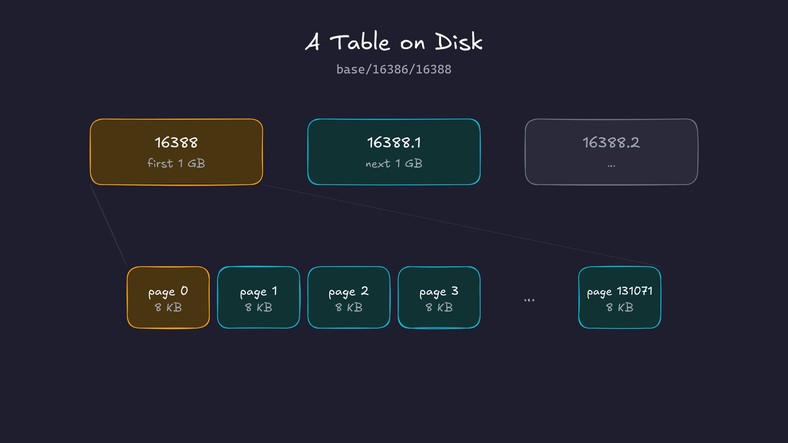
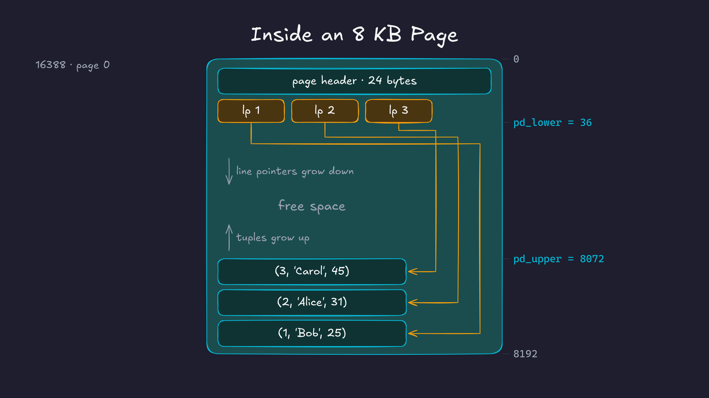

If you insert a row into a postgres table, could you go and find it on disk? The actual file, the actual bytes? That's what we're going to do in this post. We'll insert one row, find the file it lives in, and then decode it byte by byte using the structs from the postgres source code.

Prefer video? Here's the same walkthrough:



### How postgres organizes storage

Before we go inserting and searching for data, let's first build a picture of how postgres organizes data. That way, when we trace the bytes for our data, we'll know what we're looking at.

In Postgres, every table is stored in one or more files. We call these files **segment files**. A segment file can grow up to 1GB. If a table grows beyond 1GB, postgres creates another segment file for the next 1GB, then another one, and so on. For a table whose file is named `16388`, the segments would be named `16388`, `16388.1`, `16388.2`, and so on. ( The 1GB limit can be changed at the time of setup )

Each segment file is made of **pages** ( also called *blocks* ). A page is 8KB by default. This too can only be changed at compile time. The page is the smallest unit of IO in postgres: when postgres reads from or writes to a table file, it reads or writes a whole 8KB page. Any change to a row, however small, happens by changing the page that contains it.

{fig-alt="A table stored as segment files 16388, 16388.1 and 16388.2 of up to 1 GB each. The first segment is a sequence of 8 KB pages, page 0 to page 131071."}

Now let's zoom into a page. Every page has the same layout:

- A **page header** of 24 bytes at the start.
- An array of **line pointers** right after the header. Each line pointer is 4 bytes and points to one row in the page. This array grows from the top of the page downwards.
- The **tuples** ( rows ) themselves, which are stored from the bottom of the page upwards.
- The **free space** in between. New rows go here. The line pointers grow into it from the top, the tuples grow into it from the bottom.
- There's also some **special space** at the very end. Tables don't use it, but some indexes use it. This is beyond our scope for this post.

{fig-alt="Inside an 8 KB page: a 24-byte page header, then line pointers lp 1 to lp 3 pointing to the rows Bob, Alice and Carol stored from the bottom of the page, with free space in between. pd_lower is 36 and pd_upper is 8072."}

Each tuple also has a small header of its own, with things like the transaction id that created it, followed by the actual column values.

#### Why do we need line pointers?

Why not just store the tuples one after another from the start of the page?

For a moment, assume that we don't have line pointers and we placed the tuples one after the other from the start. Then row 3 in a page got deleted. Now there's a hole in the middle of the page. To reuse that space, we would want to move the other rows to close the gap. But we can't just move a row, because indexes may point to it. In order to move rows around, we may also need to move around indexes, which is not efficient. 

With line pointers, we introduce indirection. Postgres can shuffle the tuples around inside the page to close the gaps, and it only has to update the offsets in the line pointers. The line pointer numbers themselves stay the same, so every index entry that points to row 3 still finds it. This is why these are also called **slotted pages**: each row has a fixed slot, and the slot knows where the row currently lives.

<iframe src="why-line-pointers.html" title="Why line pointers" style="width:100%;aspect-ratio:800/720;border:0" loading="lazy"></iframe>

So, to summarise: a table is stored in segment files, a segment file is made of 8KB pages, and every page has a header, line pointers growing from the top, tuples growing from the bottom, and free space in the middle.

Now let's go insert some data and find it on disk. The numbers in the outputs below ( OIDs, file names, the LSN and the transaction id ) will be slightly different on your machine, but the layout will be exactly the same.

## Prerequisites

For this post, I'm assuming you know what docker containers are and how to build and run them.

I'm using the same postgres container as the [previous post](../how-postgres-handles-connections/), with a few extra tools installed for looking at binary files ( like `xxd` ). The Dockerfile is on [GitHub](https://github.com/thewalstreetjournal/postgres-playlist/tree/main/002-how-postgres-stores-data).

```bash
docker build -t postgres-17.6:v1 .

# To let the python app talk to postgres, we create a docker network
docker network create pgnet
docker run -d --name postgres --network pgnet -e POSTGRES_PASSWORD=secret postgres-17.6:v1

# Open a shell inside the container
docker exec -it postgres bash
```

I'll keep two terminals open inside the container: one for `psql` and one for looking at the files.

### Finding the data directory

Since postgres is running in this container, it must be storing its data in some directory. This location is usually in the `PGDATA` environment variable:

```bash
echo $PGDATA
# /var/lib/postgresql/data
```

If we list this directory, we see a bunch of files and subdirectories:

```bash
cd $PGDATA && ls -l
```

```
total 128
drwx------ 6 postgres postgres  4096 Mar 14 13:05 base
drwx------ 2 postgres postgres  4096 Mar 14 13:05 global
drwx------ 2 postgres postgres  4096 Mar 14 13:05 pg_commit_ts
drwx------ 2 postgres postgres  4096 Mar 14 13:05 pg_dynshmem
-rw------- 1 postgres postgres  5743 Mar 14 13:05 pg_hba.conf
-rw------- 1 postgres postgres  2640 Mar 14 13:05 pg_ident.conf
drwx------ 4 postgres postgres  4096 Mar 14 13:05 pg_logical
drwx------ 4 postgres postgres  4096 Mar 14 13:05 pg_multixact
drwx------ 2 postgres postgres  4096 Mar 14 13:05 pg_notify
drwx------ 2 postgres postgres  4096 Mar 14 13:05 pg_replslot
drwx------ 2 postgres postgres  4096 Mar 14 13:05 pg_serial
drwx------ 2 postgres postgres  4096 Mar 14 13:05 pg_snapshots
drwx------ 2 postgres postgres  4096 Mar 14 13:05 pg_stat
drwx------ 2 postgres postgres  4096 Mar 14 13:05 pg_stat_tmp
drwx------ 2 postgres postgres  4096 Mar 14 13:05 pg_subtrans
drwx------ 2 postgres postgres  4096 Mar 14 13:05 pg_tblspc
drwx------ 2 postgres postgres  4096 Mar 14 13:05 pg_twophase
-rw------- 1 postgres postgres     3 Mar 14 13:05 PG_VERSION
drwx------ 4 postgres postgres  4096 Mar 14 13:05 pg_wal
drwx------ 2 postgres postgres  4096 Mar 14 13:05 pg_xact
-rw------- 1 postgres postgres    88 Mar 14 13:05 postgresql.auto.conf
-rw------- 1 postgres postgres 30777 Mar 14 13:05 postgresql.conf
-rw------- 1 postgres postgres    36 Mar 14 13:05 postmaster.opts
-rw------- 1 postgres postgres    94 Mar 14 13:05 postmaster.pid
```

Some of these handle replication, some handle the write ahead log, some are config files. For now, we only care about `base`. This is where postgres stores the data for every database.

```bash
ls base/
# 1  16385  4  5
```

These numbers are **object identifiers**, or OIDs. Postgres gives an OID to almost everything it creates: databases, tables, indexes, roles and so on. Inside `base/`, there is one subdirectory per database, named after that database's OID.

Let's create a new database and watch a new directory show up. In the `psql` terminal ( `psql -U postgres` ):

```sql
CREATE DATABASE dummy;

SELECT oid, datname FROM pg_database;
```

We get this output:

```
  oid  |  datname
-------+------------
     5 | postgres
 16385 | mydatabase
     1 | template1
     4 | template0
 16386 | dummy
```

`1`, `4` and `5` are the default databases. `16385` is `mydatabase`, which our Dockerfile creates. And `16386` is the `dummy` database we just created. Your OIDs might be different.

```bash
ls base/
# 1  16385  16386  4  5
```

We can see the directory for our databae. If we look inside the new directory, we already see about 300 files, even though we haven't created a single table yet:

```bash
ls base/16386 | wc -l
# 298
```

These are the system catalogs, which are postgres's own internal tables. Every new database is a copy of the `template1` database, so it starts with its own copy of all of the system catalogs.

---

### Finding the table's file

Now let's create a table and insert a row. Switch to the `dummy` database with `\c dummy` and run:

```sql
CREATE TABLE users (
    id   serial PRIMARY KEY,
    name text,
    age  int
);

INSERT INTO users (name, age) VALUES ('Bob', 25);
```

To find the file for this table, postgres has a function:

```sql
SELECT pg_relation_filepath('users');
```

```
 pg_relation_filepath
----------------------
 base/16386/16388
```

So our row is somewhere inside `base/16386/16388`. This number is the table's **relfilenode**. It often matches the table's OID, but not always ( some commands like `TRUNCATE` can give the table a new file ), so it's better to query postgres than to assume.

Let's look at the file:

```bash
ls -l base/16386/16388
# -rw------- 1 postgres postgres 8192 ... base/16386/16388
```

It's exactly 8192 bytes, which is one page. Now let's dump the file bytes using `xxd`:

```bash
xxd -a base/16386/16388
```

```
00000000: 0000 0000 a8ac d401 0000 0000 1c00 d81f  ................
00000010: 0020 0420 0000 0000 d89f 4800 0000 0000  . . ......H.....
00000020: 0000 0000 0000 0000 0000 0000 0000 0000  ................
*
00001fd0: 0000 0000 0000 0000 de02 0000 0000 0000  ................
00001fe0: 0000 0000 0000 0000 0100 0300 0208 1800  ................
00001ff0: 0100 0000 0942 6f62 1900 0000 0000 0000  .....Bob........
```

This already matches the picture we had in mind. There are a few non-zero bytes at the start ( the page header and the line pointer ), a lot of empty space (zero bytes) in the middle ( the `*` means "the same line repeated" ), and a few non-zero bytes at the very end ( our tuple ). We can even see `Bob` sitting in the last line.

Now let's decode these bytes properly.

---

### Decoding the page header

The page header, line pointers and tuples are all just C structs. So if we read the structs in the postgres source code, we can interpret the bytes.

The page header is [`PageHeaderData` in `bufpage.h`](https://github.com/postgres/postgres/blob/REL_17_6/src/include/storage/bufpage.h#L155-L168):

```c
typedef struct PageHeaderData
{
	PageXLogRecPtr pd_lsn;
	uint16		pd_checksum;
	uint16		pd_flags;
	LocationIndex pd_lower;		/* offset to start of free space */
	LocationIndex pd_upper;		/* offset to end of free space */
	LocationIndex pd_special;	/* offset to start of special space */
	uint16		pd_pagesize_version;
	TransactionId pd_prune_xid;
	ItemIdData	pd_linp[FLEXIBLE_ARRAY_MEMBER]; /* line pointer array */
} PageHeaderData;
```

Everything except the line pointer array adds up to the first 24 bytes of the page. Let's print just those:

```bash
xxd -l 24 base/16386/16388
```

```
00000000: 0000 0000 a8ac d401 0000 0000 1c00 d81f  ................
00000010: 0020 0420 0000 0000                      . . ....
```

One thing to know before reading these: the numbers are stored in **little endian** order. In a multi-byte number, the least significant byte comes first. So the two bytes `1c 00` are the 16 bit number `0x001c`, and `d8 1f` is `0x1fd8`. The bits inside each byte are not reversed, only the order of the bytes.

| Bytes | Field | Raw | Value |
|---|---|---|---|
| 0–7 | `pd_lsn` | `00000000 a8acd401` | `0/1D4ACA8`, the WAL position of the last change to this page |
| 8–9 | `pd_checksum` | `00 00` | 0, data checksums are off by default |
| 10–11 | `pd_flags` | `00 00` | 0 |
| 12–13 | `pd_lower` | `1c 00` | **28**, start of the free space |
| 14–15 | `pd_upper` | `d8 1f` | **8152**, end of the free space |
| 16–17 | `pd_special` | `00 20` | 8192, the special space is empty |
| 18–19 | `pd_pagesize_version` | `04 20` | `0x2004`: page size 8192 + layout version 4 |
| 20–23 | `pd_prune_xid` | `00 00 00 00` | 0, nothing to prune yet |

`pd_lower` and `pd_upper` tell the whole story of this page. The free space starts at byte 28, which is the 24 byte header plus one 4 byte line pointer. It ends at byte 8152, which is where our tuple starts. Everything in between, 8124 bytes, is free.

The LSN will be different on your machine. We'll talk about LSNs when we look at the write ahead log.

---

### Decoding the line pointer

Right after the header, at byte 24, comes the line pointer array. A line pointer is the [`ItemIdData` struct in `itemid.h`](https://github.com/postgres/postgres/blob/REL_17_6/src/include/storage/itemid.h#L25-L30):

```c
typedef struct ItemIdData
{
	unsigned	lp_off:15,		/* offset to tuple (from start of page) */
				lp_flags:2,		/* state of line pointer, see below */
				lp_len:15;		/* byte length of tuple */
} ItemIdData;
```

It's a single 32 bit number split into three bit fields: 15 bits for the offset of the tuple, 2 bits for flags, and 15 bits for the length of the tuple. We have one row, so we have one line pointer. Let's read bytes 24 to 27 in binary:

```bash
xxd -s 24 -l 4 -b base/16386/16388
```

```
00000018: 11011000 10011111 01001000 00000000                    ..H.
```

This is where it gets slightly confusing. Because of little endian, we first have to put the four bytes back in the right order, which means reversing them:

```
00000000 01001000 10011111 11011000
```

Now we can read the fields from the right, since `lp_off` is the lowest field:

```
 lp_len (15 bits)   lp_flags (2)   lp_off (15 bits)
 000000000100100       01        001111111011000
```

- `lp_off` = `001111111011000` = **8152**. The tuple starts at byte 8152.
- `lp_flags` = `01` = **1**, which is `LP_NORMAL`. This is a normal, live row.
- `lp_len` = `000000000100100` = **36**. The tuple is 36 bytes long.

So our row starts at byte 8152 and is 36 bytes long. That means it ends at byte 8188, and the last 4 bytes of the page are just padding.

---

### Decoding the tuple

Now let's read those 36 bytes:

```bash
xxd -s 8152 -l 36 base/16386/16388
```

```
00001fd8: de02 0000 0000 0000 0000 0000 0000 0000  ................
00001fe8: 0100 0300 0208 1800 0100 0000 0942 6f62  .............Bob
00001ff8: 1900 0000                                ....
```

Every tuple starts with a header, defined as [`HeapTupleHeaderData` in `htup_details.h`](https://github.com/postgres/postgres/blob/REL_17_6/src/include/access/htup_details.h#L153-L179). The fields add up to 23 bytes. Postgres then rounds that up to 24, so that the column data starts at an aligned offset.

| Bytes | Field | Raw | Value |
|---|---|---|---|
| 0–3 | `t_xmin` | `de 02 00 00` | 734, the transaction that inserted this row |
| 4–7 | `t_xmax` | `00 00 00 00` | 0, no transaction has deleted it |
| 8–11 | `t_cid` | `00 00 00 00` | 0, the first command in its transaction |
| 12–17 | `t_ctid` | `0000 0000 0100` | (0, 1): page 0, line pointer 1, the row points at itself |
| 18–19 | `t_infomask2` | `03 00` | 3, the number of columns |
| 20–21 | `t_infomask` | `02 08` | `0x0802`: `HEAP_HASVARWIDTH` ( has a text column ) and `HEAP_XMAX_INVALID` |
| 22 | `t_hoff` | `18` | 24, the column data starts 24 bytes into the tuple |
| 23 | | `00` | padding |

You can check `t_xmin` from psql: `SELECT xmin, * FROM users;` returns `734`. Your number will be different.

The `t_ctid` field is the same ( page, line pointer ) pair that indexes use. Here we can see it in the bytes: `0000 0000` is block 0 and `0100` is line pointer 1.

After the header come the 12 bytes of actual data:

```bash
xxd -s 8176 -l 12 base/16386/16388
```

```
00001ff0: 0100 0000 0942 6f62 1900 0000            .....Bob....
```

| Bytes | Column | Raw | Value |
|---|---|---|---|
| 0–3 | `id` ( int ) | `01 00 00 00` | 1 |
| 4 | `name` length | `09` | a 1 byte length header |
| 5–7 | `name` ( text ) | `42 6f 62` | "Bob" |
| 8–11 | `age` ( int ) | `19 00 00 00` | 25 |

The integers are easy: 4 bytes each, little endian. The text column is more interesting. Text has a variable length, so postgres needs to store the length too. For short values, it uses a single length byte: the total length shifted left by one, with the lowest bit set to 1 to mark it as a short header ( see [`SET_VARSIZE_1B` in `varatt.h`](https://github.com/postgres/postgres/blob/REL_17_6/src/include/varatt.h#L236-L237) ). "Bob" is 3 bytes, plus 1 for the header, is 4. `(4 << 1) | 1 = 9`, which is the `09` we see.

And that's our row: `(1, 'Bob', 25)`, found on disk, byte by byte.

---

### The easy way: pageinspect

Decoding bytes by hand is tedious, and nobody really needs to do it. But I think it's awesome to do it once. But postgres comes with an extension called `pageinspect` that does all of this for us:

```sql
CREATE EXTENSION pageinspect;

SELECT lower, upper, special, pagesize, version
FROM page_header(get_raw_page('users', 0));
```

```
 lower | upper | special | pagesize | version
-------+-------+---------+----------+---------
    28 |  8152 |    8192 |     8192 |       4
```

```sql
SELECT lp, lp_off, lp_flags, lp_len, t_xmin, t_ctid, t_hoff, t_data
FROM heap_page_items(get_raw_page('users', 0));
```

```
 lp | lp_off | lp_flags | lp_len | t_xmin | t_ctid | t_hoff |           t_data
----+--------+----------+--------+--------+--------+--------+----------------------------
  1 |   8152 |        1 |     36 |    734 | (0,1)  |     24 | \x0100000009426f6219000000
```

Every number matches what we decoded by hand. There is also [`pg_filedump`](https://github.com/df7cb/pg_filedump), a command line tool that can read the files directly, without a running server.

---

### Summary

Postgres stores the data of a table in segment files of up to 1GB. Each segment file is made of 8KB pages, and the page is the unit of IO in postgres. Each page has a 24 byte header, an array of line pointers growing from the top, the tuples growing from the bottom, and free space in between.

When we insert a row, postgres looks for a page with enough free space. If there isn't one, it adds a new page to the end of the table's file. Once the file reaches 1GB, a new segment file is started and the process repeats.

---

### What I left out

A few things that didn't fit in this post:

- **Forks.** Right now our table has a single file. Over time, postgres also creates `16388_fsm` ( the free space map, which helps postgres find a page with enough room for a new row ) and `16388_vm` ( the visibility map, which helps `VACUUM` skip pages and makes index-only scans possible ). These usually show up after the first `VACUUM`. The free space map gets its own post next.
- **TOAST.** Large values, like a long text column, don't fit in an 8KB page. Postgres compresses them and/or moves them to a separate TOAST table, and the row only keeps a pointer.
- **NULLs.** If a row has NULL values, the tuple header gets an extra bitmap marking which columns are NULL, and `t_hoff` grows to make room for it.
- **Alignment.** Columns are aligned based on their type. An `int` must start at a multiple of 4 bytes, for example. In our row that worked out with no padding, but column order can waste space in other tables.
- **Updates.** An `UPDATE` in postgres doesn't change the row in place. It writes a new version of the row and sets `t_xmax` and `t_ctid` on the old one. That's a topic for another post.

---

### Credits and Resources

For this post, I have heavily used Claude Code. Along with that, I have relied on the following resources:

1. [Database File Layout](https://www.postgresql.org/docs/17/storage-file-layout.html) and [Database Page Layout](https://www.postgresql.org/docs/17/storage-page-layout.html), PostgreSQL docs
2. [Intro to Database Systems by CMU](https://15445.courses.cs.cmu.edu/fall2025/)
3. [Postgres Source Code](https://github.com/postgres/postgres/tree/REL_17_6)

---
