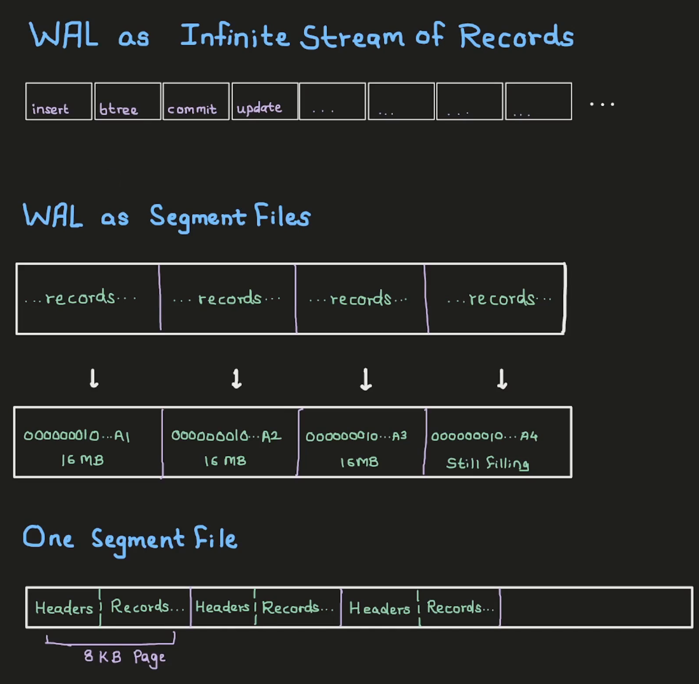

We all know that Postgres has a write-ahead log ( WAL ) for recovery and replication. We probably also know how to configure it, or how to set up replication with it. But we rarely look at what the WAL is actually made of, or how a record gets written into it.

So in this post, we'll do that. We'll insert a single row, find its WAL record on disk, and then go through the Postgres source to see who wrote that record and how it gets replayed. It'll be easier to follow if you know how Postgres organizes its storage. I covered that in an [earlier post](../how-postgres-stores-data/index.qmd).

Prefer video? Here's the same walkthrough:



---

### How the WAL is laid out

A write-ahead log is an infinite, append-only stream of records. For the tables we normally use, every change is recorded in the WAL: an insert, an update, a change to an index. Each of them produces a WAL record. And once a record is logged, it is immutable.

But we can't write an infinite stream to disk as a single file. So Postgres breaks the stream into chunks, and each chunk is a file on disk. These chunks are called **segments**, and each segment is 16MB by default.

Each segment is again split into **pages** of 8KB each. Every page starts with some headers ( things like the timeline ID and some flags ), followed by the actual WAL records.

{fig-alt="Top: the WAL as an infinite stream of records such as insert, btree, commit and update. Middle: the same records split into 16MB segment files named 000000010...A1 to A4, the last one still filling. Bottom: one segment file split into 8KB pages, each with headers followed by records."}

Two small details here. The first page of a segment has a few more headers than the rest: the system identifier, the segment size, and the WAL page size. And a WAL record can cross a page boundary. So every page header has a flag that tells Postgres whether the start of this page is a continuation of a record from the previous page.

Each record also gets a **Log Sequence Number** ( LSN ). It's a 64-bit number that keeps increasing and is unique for every record. We don't need to worry about how Postgres generates it. What matters for us is that the LSN tells us where a record lives. If we know the LSN of an INSERT record, we can find that record and read its details. Without the LSN, finding it is possible, but quite hard.

So let's find one.

---

### Prerequisites

I'm using the same postgres 17.6 container as the earlier posts. The Dockerfile is on [GitHub](https://github.com/thewalstreetjournal/postgres-playlist/tree/main/004-decoding-wal-in-postgres).

```bash
docker build -t postgres-17.6:v1 .
docker network create pgnet
docker run -d --name postgres --network pgnet -e POSTGRES_PASSWORD=secret postgres-17.6:v1
```

I keep two terminals open: one running `psql`, and one with a shell inside the container for looking at the files.

---

### Finding our INSERT in the WAL

This is a freshly created container, so nothing has happened in it yet. But Postgres has already set up its WAL and has a current LSN. We can get it with `pg_current_wal_lsn()`:

```sql
SELECT pg_current_wal_lsn() AS lsn_before_any_activity \gset
\echo LSN before any activity: :lsn_before_any_activity
```

```
LSN before any activity: 0/195A318
```

`\gset` stores the result in a psql variable so we can reuse it later. It also hides the output, which is why there's an `\echo` after it.

Now let's create a table and save the LSN again. Then insert one row and save it once more:

```sql
CREATE TABLE users (id integer, name text, email text);
SELECT pg_current_wal_lsn() AS lsn_after_creating_table \gset
\echo LSN after creating table: :lsn_after_creating_table

INSERT INTO users VALUES (1, 'Alice', 'alice@example.com');
SELECT pg_current_wal_lsn() AS lsn_after_inserting_a_tuple \gset
\echo LSN after INSERT: :lsn_after_inserting_a_tuple
```

```
LSN after creating table: 0/19773B0
LSN after INSERT: 0/1977468
```

So we now have three LSNs: one before the `CREATE TABLE`, one between the `CREATE TABLE` and the `INSERT`, and one after the `INSERT`. The records we're interested in are somewhere between them.

Everything Postgres stores lives in its data directory:

```sql
SHOW data_directory;
```

```
      data_directory
--------------------------
 /var/lib/postgresql/data
```

In the other terminal, the WAL is in the `pg_wal` directory inside it:

```bash
docker exec -it postgres bash
cd /var/lib/postgresql/data/pg_wal
ls
```

```
000000010000000000000001  archive_status  summaries
```

There's only one segment file, since this is a fresh instance. A busy system will have many more. To find out which segment an LSN belongs to, and where inside that file it is, Postgres has `pg_walfile_name_offset`:

```sql
SELECT pg_walfile_name_offset(:'lsn_before_any_activity');
```

```
       pg_walfile_name_offset
------------------------------------
 (000000010000000000000001,9806616)
```

It gives us the segment file's name and the byte offset inside it. Doing the same for the other two:

```sql
SELECT pg_walfile_name_offset(:'lsn_after_creating_table');
SELECT pg_walfile_name_offset(:'lsn_after_inserting_a_tuple');
```

```
 (000000010000000000000001,9925552)
 (000000010000000000000001,9925736)
```

How does it compute this? The LSN itself carries this information. With 16MB segments, the upper bits of the LSN give the segment number, and the lower 24 bits are the byte offset inside that segment. For example, `0/19773B0` is segment `1`, offset `0x9773B0`, which is `9925552`.

The two offsets around the `CREATE TABLE` are far apart, so that range has a lot of data. The two around our `INSERT` are only 184 bytes apart. Let's dump those bytes with `xxd`:

```bash
xxd -s 9925552 -l "$((9925736 - 9925552))" ./000000010000000000000001
```

```
009773b0: 3200 0000 0000 0000 486f 9701 0000 0000  2.......Ho......
009773c0: 1008 0000 9780 5a82 ff18 0000 0000 0000  ......Z.........
009773d0: 0000 00b9 3901 f102 0000 f102 0000 f002  ....9...........
009773e0: 0000 0000 0000 0000 5300 0000 f102 0000  ........S.......
009773f0: b073 9701 0000 0000 800a 0000 6f26 a7d3  .s..........o&..
00977400: 0060 2200 7f06 0000 0500 0000 0640 0000  .`"..........@..
00977410: 0000 0000 ff03 0300 0208 1800 0100 0000  ................
00977420: 0d41 6c69 6365 2561 6c69 6365 4065 7861  .Alice%alice@exa
00977430: 6d70 6c65 2e63 6f6d 0100 0000 0000 0000  mple.com........
00977440: 2200 0000 f102 0000 e873 9701 0000 0000  "........s......
00977450: 0001 0000 6352 4a9d ff08 2f2b f9c2 59fe  ....cRJ.../+..Y.
00977460: 0200 0000 0000 0000                      ........
```

We can already see `Alice` and `alice@example.com` in there. We could try to read the rest byte by byte, like we did for the table pages in the earlier post. But Postgres ships a tool that does it for us, `pg_waldump`. It takes LSNs, not byte offsets:

```bash
pg_waldump -s 0/19773B0 -e 0/1977468
```

```
rmgr: Standby     len (rec/tot):     50/    50, tx:          0, lsn: 0/019773B0, prev 0/01976F48, desc: RUNNING_XACTS nextXid 753 latestCompletedXid 752 oldestRunningXid 753
rmgr: Heap        len (rec/tot):     83/    83, tx:        753, lsn: 0/019773E8, prev 0/019773B0, desc: INSERT+INIT off: 1, flags: 0x00, blkref #0: rel 1663/5/16390 blk 0
rmgr: Transaction len (rec/tot):     34/    34, tx:        753, lsn: 0/01977440, prev 0/019773E8, desc: COMMIT 2026-09-13 10:43:50.075183 UTC
```

One SQL statement produced three WAL records. A more complicated statement could produce many more.

- The first one belongs to the **Standby** resource manager. It describes the transactions running at that moment. We don't need it here.
- The second one is our insert. It comes from the **Heap** resource manager. `INSERT+INIT` means Postgres inserted the tuple and also initialized a new heap page in the same record, since this is the first row in the table.
- The third one is the **Transaction** resource manager's `COMMIT`, because the insert ran inside a transaction.

If we did the same for the `CREATE TABLE`, we'd see many more records, mostly for the system catalogs it updates.

::: {.callout-note collapse="true"}
## The Heap record, byte by byte

The Heap record starts at LSN `0/019773E8`, offset `0x9773E8` in the dump. Its 83 bytes are:

| Bytes | Field | Value |
|---|---|---|
| `5300 0000` | `xl_tot_len` | 83 bytes |
| `f102 0000` | `xl_xid` | transaction 753 |
| `b073 9701 0000 0000` | `xl_prev` | `0/019773B0`, the Standby record before it |
| `80` | `xl_info` | `XLOG_HEAP_INSERT` with `XLOG_HEAP_INIT_PAGE` |
| `0a` | `xl_rmid` | 10, the Heap resource manager |
| `0000` | | padding |
| `6f26 a7d3` | `xl_crc` | checksum |
| `00 60 2200` | block header | block 0, will init the page, has 34 bytes of data |
| `7f06 0000 0500 0000 0640 0000` | relation | 1663 / 5 / 16390 |
| `0000 0000` | block number | 0 |
| `ff 03` | main data header | 3 bytes of main data |
| `0300 0208 18` | `xl_heap_header` | 3 columns, infomask `0x0802`, header size 24 |
| `00` | | padding up to `t_hoff` |
| `0100 0000` | `id` | 1 |
| `0d 416c696365` | `name` | `'Alice'` |
| `25 616c69636540...` | `email` | `'alice@example.com'` |
| `0100 00` | `xl_heap_insert` | offset 1, flags `0x00` |

These are the same pieces we'll see being registered in `heap_insert` below.
:::

So these are the WAL records for the operations we ran. But what is a "resource manager", and how do we interpret these records?

---

### Resource managers

Let's pretend for a moment that we're writing the WAL code for Postgres. Different operations need to log different things. An INSERT record needs enough information to rebuild the tuple and the heap page it went into. A CREATE TABLE record, on the other hand, needs to know about the physical file that was created for the table.

So every record has the same fixed header, with things like the transaction ID and the LSN of the previous record. What comes after the header, let's call it the payload, is different for every operation.

How would we design this? We'd keep a registry, say an array. In it, we'd register a "resource manager" for each kind of operation. Each resource manager has a name and implements a set of functions: how to replay its records during recovery, how to describe them, and so on. In Rust we'd do this with trait objects. In Java, with interfaces. In C, with function pointers.

And that's what Postgres does. The registry is an array called `RmgrTable`, and each resource manager in it is a struct called `RmgrData`.

---

### In the source code

All links below are to the [REL_17_6](https://github.com/postgres/postgres/tree/REL_17_6) tag.

The fixed header is the [`XLogRecord`](https://github.com/postgres/postgres/blob/REL_17_6/src/include/access/xlogrecord.h#L41-L53) struct in `xlogrecord.h`. This is the 24-byte header every WAL record starts with:

```c
typedef struct XLogRecord
{
	uint32		xl_tot_len;		/* total len of entire record */
	TransactionId xl_xid;		/* xact id */
	XLogRecPtr	xl_prev;		/* ptr to previous record in log */
	uint8		xl_info;		/* flag bits, see below */
	RmgrId		xl_rmid;		/* resource manager for this record */
	/* 2 bytes of padding here, initialize to zero */
	pg_crc32c	xl_crc;			/* CRC for this record */

	/* XLogRecordBlockHeaders and XLogRecordDataHeader follow, no padding */

} XLogRecord;
```

The comment [above it](https://github.com/postgres/postgres/blob/REL_17_6/src/include/access/xlogrecord.h#L21-L30) describes the full layout of a record: the fixed header, then a header for each block ( page ) the record touches, then the data for those blocks, and finally the "main data" that belongs to the resource manager.

The registry, [`RmgrTable`](https://github.com/postgres/postgres/blob/REL_17_6/src/backend/access/transam/rmgr.c#L47-L52), is in `rmgr.c`:

```c
#define PG_RMGR(symname,name,redo,desc,identify,startup,cleanup,mask,decode) \
	{ name, redo, desc, identify, startup, cleanup, mask, decode },

RmgrData	RmgrTable[RM_MAX_ID + 1] = {
#include "access/rmgrlist.h"
};
```

Its entries come from [`rmgrlist.h`](https://github.com/postgres/postgres/blob/REL_17_6/src/include/access/rmgrlist.h#L27-L49). That's where all the resource managers are listed, including the Heap, Standby and Transaction ones we saw in `pg_waldump`. The [Heap entry](https://github.com/postgres/postgres/blob/REL_17_6/src/include/access/rmgrlist.h#L38) looks like this:

```c
PG_RMGR(RM_HEAP_ID, "Heap", heap_redo, heap_desc, heap_identify, NULL, NULL, heap_mask, heap_decode)
```

Each entry fills in an [`RmgrData`](https://github.com/postgres/postgres/blob/REL_17_6/src/include/access/xlog_internal.h#L349-L360), which is mostly function pointers:

```c
typedef struct RmgrData
{
	const char *rm_name;
	void		(*rm_redo) (XLogReaderState *record);
	void		(*rm_desc) (StringInfo buf, XLogReaderState *record);
	const char *(*rm_identify) (uint8 info);
	void		(*rm_startup) (void);
	void		(*rm_cleanup) (void);
	void		(*rm_mask) (char *pagedata, BlockNumber blkno);
	void		(*rm_decode) (struct LogicalDecodingContext *ctx,
							  struct XLogRecordBuffer *buf);
} RmgrData;
```

Every resource manager implements its own versions of these functions, and the WAL machinery calls them through these pointers. That's roughly the design we had in mind.

#### Writing the record: `heap_insert`

Now let's follow our INSERT. Every row inserted into a regular table goes through [`heap_insert`](https://github.com/postgres/postgres/blob/REL_17_6/src/backend/access/heap/heapam.c#L2038) in `heapam.c`. While reading it, keep in mind that all of this is for recovery. Whatever gets logged here is what the redo function will use to recreate the change.

Before any WAL is written, `heap_insert` does a few other things. It prepares the tuple ( fills in the header fields, and TOASTs it if a value is too long ), finds a page with enough room for it, and handles some conflict checks and the visibility map.

Then the [WAL part](https://github.com/postgres/postgres/blob/REL_17_6/src/backend/access/heap/heapam.c#L2116) starts. First, there's a [small check](https://github.com/postgres/postgres/blob/REL_17_6/src/backend/access/heap/heapam.c#L2132-L2142):

```c
if (ItemPointerGetOffsetNumber(&(heaptup->t_self)) == FirstOffsetNumber &&
	PageGetMaxOffsetNumber(page) == FirstOffsetNumber)
{
	info |= XLOG_HEAP_INIT_PAGE;
	bufflags |= REGBUF_WILL_INIT;
}
```

If this tuple is the first and only one on the page, the record gets the `INIT` flag. That's the `+INIT` we saw in `pg_waldump`. During recovery, it tells Postgres that this is a fresh page, so it can just create a new page and put the tuple in it. Otherwise, Postgres would have to read the existing page first and then insert into it.

After that, logging the record takes four steps ( [L2167–L2189](https://github.com/postgres/postgres/blob/REL_17_6/src/backend/access/heap/heapam.c#L2167-L2189) ):

```c
XLogBeginInsert();
XLogRegisterData((char *) &xlrec, SizeOfHeapInsert);
...
XLogRegisterBuffer(0, buffer, REGBUF_STANDARD | bufflags);
XLogRegisterBufData(0, (char *) &xlhdr, SizeOfHeapHeader);
XLogRegisterBufData(0,
					(char *) heaptup->t_data + SizeofHeapTupleHeader,
					heaptup->t_len - SizeofHeapTupleHeader);
...
recptr = XLogInsert(RM_HEAP_ID, info);
```

1. **`XLogBeginInsert()`** checks whether we're allowed to write WAL at all. For example, a replica that is replaying WAL can't write WAL records of its own.
2. **`XLogRegisterData()`** registers the "main" data of the record. For the Heap insert, that's a tiny struct, [`xl_heap_insert`](https://github.com/postgres/postgres/blob/REL_17_6/src/include/access/heapam_xlog.h#L159-L165): the offset of the slot on the page the tuple went into, and some flags. These are the `off: 1, flags: 0x00` in the `pg_waldump` output.
3. **`XLogRegisterBuffer()`** registers the in-memory page we modified. From it, Postgres works out the tablespace, database, relation file and block number. That's the `rel 1663/5/16390 blk 0` in `pg_waldump`. During replay, this tells Postgres which page on disk to change.
4. **`XLogRegisterBufData()`**, called twice, attaches data to that page. The first call registers the tuple's header, and the second registers the tuple data itself. This is where our row ends up in the WAL.

Finally, [`XLogInsert`](https://github.com/postgres/postgres/blob/REL_17_6/src/backend/access/transam/xloginsert.c#L474) assembles everything that was registered into one record, in the right order. It computes the checksum, stamps the resource manager's ID on the record, and copies it into the WAL buffers, from where it's written to `pg_wal`. It returns the record's LSN.

#### Replaying the record: `heap_redo`

All of this was so the change can be replayed during recovery. For the Heap resource manager, that's [`heap_redo`](https://github.com/postgres/postgres/blob/REL_17_6/src/backend/access/heap/heapam.c#L10338). It's a simple switch on the record type:

```c
switch (info & XLOG_HEAP_OPMASK)
{
	case XLOG_HEAP_INSERT:
		heap_xlog_insert(record);
		break;
	case XLOG_HEAP_DELETE:
		heap_xlog_delete(record);
		break;
	case XLOG_HEAP_UPDATE:
		heap_xlog_update(record, false);
		break;
	...
}
```

[`heap_xlog_insert`](https://github.com/postgres/postgres/blob/REL_17_6/src/backend/access/heap/heapam.c#L9592) does the reverse of what we saw in `heap_insert`. It takes the WAL record and redoes the insert on the same page, in the same slot. And here's the `INIT` flag being used ( [L9638–L9646](https://github.com/postgres/postgres/blob/REL_17_6/src/backend/access/heap/heapam.c#L9638-L9646) ):

```c
if (XLogRecGetInfo(record) & XLOG_HEAP_INIT_PAGE)
{
	buffer = XLogInitBufferForRedo(record, 0);
	page = BufferGetPage(buffer);
	PageInit(page, BufferGetPageSize(buffer), 0);
	action = BLK_NEEDS_REDO;
}
else
	action = XLogReadBufferForRedo(record, 0, &buffer);
```

So for one INSERT, the Heap resource manager handles everything: `heap_insert` writes the record, and `heap_redo` replays it during recovery.

---

### Summary

- The WAL is an infinite stream of records, split into 16MB segment files, which are further split into 8KB pages.
- Every record can be located by its LSN. Each record has a fixed header, followed by a payload specific to that operation.
- Resource managers define what goes in the payload, how to replay it, and how to decode it. They are registered in `RmgrTable`.
- Tools like `pg_waldump` let us read the WAL in a human-readable form.

---

### What I left out

- **Full-page images.** After every checkpoint, the first change to a page writes the entire 8KB page into the WAL, to protect against torn pages.
- **Redo is safe to repeat.** Replaying a record on a page that already has the change does nothing. The page's LSN tells Postgres whether the change is already there.
- **`wal_level` changes what gets logged.** Under `wal_level = logical`, the INSERT record gets an extra flag ( `0x08` ) and always keeps the tuple data, so logical decoding can read it.
- **Indexes write their own records.** An insert into a table with an index also produces records from the index's resource manager ( for example, Btree ), separate from the Heap record.

---

### Credits and Resources

1. [WAL Internals](https://www.postgresql.org/docs/17/wal-internals.html), PostgreSQL docs
2. [pg_waldump](https://www.postgresql.org/docs/17/pgwaldump.html), PostgreSQL docs
3. [The transam README](https://github.com/postgres/postgres/blob/REL_17_6/src/backend/access/transam/README) in the postgres source
4. [Postgres Source Code](https://github.com/postgres/postgres/tree/REL_17_6)

---
