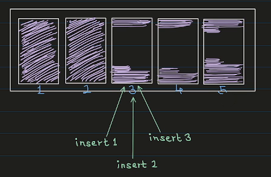
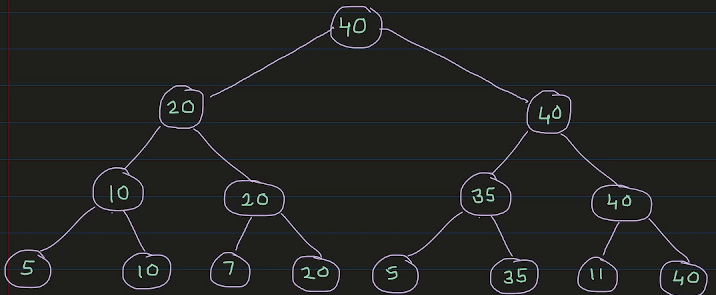
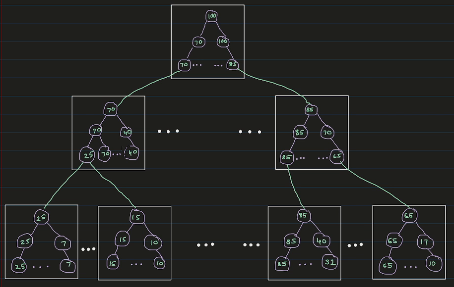

Postgres stores data on disk in 8KB pages. Every time we insert a row, postgres has to find a page with enough free space to fit that row. That's easy when the table is small. But a 100GB table has around 13 million pages, and the free space in each of them keeps changing as rows are inserted and deleted. So how does postgres find a page for the new row so quickly?

The answer is a data structure called the **Free Space Map** ( FSM ). In this post, we'll build it up step by step and see how Postgres implements it.

Prefer video? Here's the same walkthrough:



---

### The wishlist

Before looking at what postgres does, let's write down what we want from this data structure.

**1. Search and update should be fast.** Before inserting a row, we search for a page with enough free space. After the insert, we update that page's free space. Both of these happen on every insert, so both should be something like O(log n).

**2. Finding the maximum free space should be instant.** If even the page with the maximum free space can't accommodate our row, there's no point searching through the other pages. We should immediately give up and add a new, empty page to the table. So checking the maximum free space size has to be O(1).

**3. Inserts should be spread across pages.** This one is a bit nuanced. Say we did the simplest thing: go through the pages one by one and pick the first one with enough room. If page 3 has a lot of free space, the first insert goes to page 3. So does the second, and the third.

{fig-alt="Five pages. Pages 1 and 2 are full, pages 3, 4 and 5 have free space. Inserts 1, 2 and 3 all go to page 3."}

Every insert adds onto the same page. That's bad for performance, because all those inserts end up fighting over the same page. If pages 3, 4 and 5 all have room, we'd rather send one insert to each of them.

So the wishlist is:

1. Search and update in O(log n).
2. Find the maximum free space in O(1).
3. Spread the inserts evenly.

---

### A Max-Heap

There is one data structure that already gives us the first two: a **max-heap**.

The heap nodes store the free space of each page, one heap node per page. Every internal node stores the maximum of its two children. So the root always holds the largest free space across all pages ( that's our O(1) maximum ), and searching or updating means walking one path from the root to a leaf or back up ( that's O(log n) ).

So how do we now spread the inserts evenly? For this, postgres implements a **round-robin** search:

- The search starts at a leaf, not at the root.
- Postgres remembers where the last search ended, in a variable called `next_slot`. The next search starts from there, and only moves to the right ( wrapping around at the end ).

The search itself has two phases:

1. **Climb.** Starting from the `next_slot` leaf, check if the current node has enough free space. If not, move one node to the right, then climb up to its parent. Repeat until you reach a node with enough space.
2. **Descend.** Treat that node as the root and walk down like a normal heap search, preferring the left child whenever it has enough space, until you reach a leaf.

Moving right-then-up means we only ever look to the right of where we started, and the area we cover doubles with each step. So we still find a page in O(log n), but each search starts where the last one stopped, and the inserts spread out across pages.

Let's do a dry run on this tree. The leaves are the free spaces of 8 pages, numbered 0 to 7:

{fig-alt="A max-heap with leaves 5, 10, 7, 20, 5, 35, 11, 40. The level above has 10, 20, 35, 40, then 20 and 40, and the root is 40."}

**Search(8)**, with `next_slot = 0`:

- Start at leaf 0, which has 5. Not enough.
- Move right to leaf 1 and climb to its parent, which has 10. That's enough, so the climb stops.
- Descend from 10: the left child has 5 ( not enough ), the right child has 10. That's leaf 1.
- Return page 1, and set `next_slot = 2`.

**Search(25)**, with `next_slot = 2`:

- Start at leaf 2, which has 7. Not enough.
- Move right to leaf 3 and climb to its parent, which has 20. Still not enough.
- Move right to the node with 35 and climb to its parent, which has 40. That's enough.
- Descend from 40: the left child has 35, which is enough, so go left. From 35: the left child has 5, the right child has 35. That's leaf 5.
- Return page 5, and set `next_slot = 6`.

Notice that the second search never looked at pages 0 or 1. It started where the first one stopped.

---

### From one page to millions

There is one more problem. This max-heap has to live on disk, and everything postgres stores on disk lives in 8KB pages. One 8KB page can hold the max-heap for about 4,000 data pages. That's nowhere near the millions of pages we want to handle.

So postgres splits the heap across many pages and arranges those pages as a tree too. Each FSM page holds its own small max-heap. The leaves of a top-level FSM page don't describe data pages. Each leaf holds the root value of a child FSM page one level below. Only the leaves of the bottom-level FSM pages hold the free space of the actual data pages.

{fig-alt="Three levels of FSM pages. Each FSM page contains a small max-heap. The leaves of the root page match the roots of the level-1 pages, and the leaves of level-1 pages match the roots of the bottom-level pages."}

So we have a tree of FSM pages, and inside each FSM page there is a max-heap. Put together, it's still one big max-heap.

The search changes a little:

1. Start at the root FSM page and go down level by level.
2. Inside each FSM page, run the same climb-and-descend search. It tells us which child page to read next. At the bottom level, it tells us which data page to use.

For every search, postgres reads exactly three FSM pages: the root, one page from the middle level, and one from the bottom level.

How far does this scale? With 8KB pages, each FSM page has room for 4,069 leaves. Three levels give us 4,069 × 4,069 × 4,069, about 67 billion pages. That's more than the roughly 4 billion pages a single postgres table can have anyway. So reading 3 FSM pages is enough to find room for a row, even in the biggest table postgres supports.

To summarise: when we insert a row, postgres checks the root of the FSM. If even the biggest free space isn't enough, it adds a new page to the table. Otherwise, it walks down the three levels of the FSM, doing a round-robin search inside each FSM page, and ends up at a data page with enough room.

---

### Prerequisites

I'm using the same postgres container as the earlier posts. The Dockerfile is on [GitHub](https://github.com/thewalstreetjournal/postgres-playlist/tree/main/003-fsm-data-structure). The `pg_freespacemap` extension we'll use is included in the official postgres image.

```bash
docker build -t postgres-17.6:v1 .
docker network create pgnet
docker run -d --name postgres --network pgnet -e POSTGRES_PASSWORD=secret postgres-17.6:v1
docker exec -it postgres bash
```

I keep two terminals open inside the container: one for `psql -U postgres` and one for looking at the files.

---

### The FSM in the terminal

Let's switch to a test database and create a table:

```sql
CREATE DATABASE dummy;
\c dummy

CREATE TABLE items (id serial, data text);

SELECT pg_relation_filepath('items');
```

```
 pg_relation_filepath
----------------------
 base/16386/16388
```

The FSM is stored per table, right next to the table's data file. In the other terminal:

```bash
cd $PGDATA
ls -l base/16386 | grep 16388
```

```
-rw------- 1 postgres postgres     0 ... 16388
```

There's just the data file, and it's empty: zero bytes, because we haven't inserted anything yet. There is no FSM file. Postgres is lazy about the FSM. It won't create it until it needs it.

Let's insert enough rows to fill a few pages:

```sql
INSERT INTO items (data)
SELECT repeat('x', 200) FROM generate_series(1, 200);
```

```bash
ls -l base/16386 | grep 16388
```

```
-rw------- 1 postgres postgres 49152 ... 16388
-rw------- 1 postgres postgres 24576 ... 16388_fsm
```

The table now has 6 pages ( 49152 / 8192 ), and a new file, `16388_fsm`, has appeared. It's 24KB, which is 3 pages. That's what we'd expect: the root FSM page, one page at the middle level, and one page at the bottom level. These pages are stored in the file depth-first. So if the table grows enough to need a second bottom-level page, it goes right after the first one.

We won't decode the raw bytes this time. Instead, postgres has an extension that reads the FSM for us:

```sql
CREATE EXTENSION IF NOT EXISTS pg_freespacemap;

SELECT * FROM pg_freespace('items');
```

```
 blkno | avail
-------+-------
     0 |   128
     1 |   128
     2 |   128
     3 |   128
     4 |   128
     5 |     0
```

Each row is 200 x's plus some headers, so 34 of them fit in a page. The first five pages are nearly full, with only 128 bytes left. The last page says 0, but it isn't actually full: it only has 30 rows. Postgres records a page's free space in the FSM when it moves on from that page, and we never moved on from the last one.

Now let's delete half the rows:

```sql
DELETE FROM items WHERE id % 2 = 0;

SELECT * FROM pg_freespace('items');
```

```
 blkno | avail
-------+-------
     0 |   128
     1 |   128
     2 |   128
     3 |   128
     4 |   128
     5 |     0
```

Nothing changed. Postgres is lazy here too. A `DELETE` only marks the rows as deleted. The space is reclaimed later by `VACUUM`, which also updates the FSM. We can run it ourselves:

```sql
VACUUM items;

SELECT * FROM pg_freespace('items');
```

```
 blkno | avail
-------+-------
     0 |  4064
     1 |  4064
     2 |  4064
     3 |  4064
     4 |  4064
     5 |  4544
```

Now every page is about half empty, which matches the half of the rows we deleted. If you list the files again, you'll also see a `16388_vm` file. That's the visibility map, which `VACUUM` creates. It isn't in the scope of this post.

---

### In the source code

The FSM code lives in [`src/backend/storage/freespace`](https://github.com/postgres/postgres/tree/REL_17_6/src/backend/storage/freespace). The [README](https://github.com/postgres/postgres/blob/REL_17_6/src/backend/storage/freespace/README) there is a very readable description of the whole design.

The search inside one FSM page is [`fsm_search_avail` in `fsmpage.c`](https://github.com/postgres/postgres/blob/REL_17_6/src/backend/storage/freespace/fsmpage.c#L158). The climb is just a few lines ( [L227–L238](https://github.com/postgres/postgres/blob/REL_17_6/src/backend/storage/freespace/fsmpage.c#L227-L238) ):

```c
nodeno = target;
while (nodeno > 0)
{
    if (fsmpage->fp_nodes[nodeno] >= minvalue)
        break;

    /*
     * Move to the right, wrapping around on same level if necessary, then
     * climb up.
     */
    nodeno = parentof(rightneighbor(nodeno));
}
```

After the descend, it updates the start point for the next search ( [L303](https://github.com/postgres/postgres/blob/REL_17_6/src/backend/storage/freespace/fsmpage.c#L303) ):

```c
fsmpage->fp_next_slot = slot + (advancenext ? 1 : 0);
```

Going down the three levels happens in [`fsm_search` in `freespace.c`](https://github.com/postgres/postgres/blob/REL_17_6/src/backend/storage/freespace/freespace.c#L678). It reads one FSM page per level and calls `fsm_search_avail` on it. One small detail there: `advancenext` is only true at the bottom level ( [L697](https://github.com/postgres/postgres/blob/REL_17_6/src/backend/storage/freespace/freespace.c#L697) ). So it's the bottom-level pages, the ones pointing at real data pages, that move their `next_slot` forward and spread the inserts.

---

### What I left out

- **Quantization.** Postgres doesn't store the exact free space of a page. It stores one byte per page: 256 categories of 32 bytes each ( `FSM_CATEGORIES` and `FSM_CAT_STEP` in [`freespace.c`](https://github.com/postgres/postgres/blob/REL_17_6/src/backend/storage/freespace/freespace.c#L64-L65) ). The exact free space would need 13 bits. Postgres rounds the available space down and the requested space up, so it never sends a row to a page that can't fit it. That's why we saw neat numbers like 128 and 4064 above.
- **The FSM is not WAL-logged.** It's treated as a hint. If it's wrong after a crash, that's fine: searches detect and fix broken FSM pages, and `VACUUM` rewrites the correct values.
- **The FSM can be stale.** It's mostly updated by `VACUUM`, and by inserts that find a page full and move on. So a page can have more ( or less ) room than the FSM says. If an insert lands on a page that's actually full, it records the real value and searches again.
- **The tree depth.** The three levels are a compile-time constant ( [`FSM_TREE_DEPTH`](https://github.com/postgres/postgres/blob/REL_17_6/src/backend/storage/freespace/freespace.c#L75) ). With very small page sizes, postgres would use four levels instead.

---

### Credits and Resources

For this post, I have heavily used Claude Code. Along with that, I have relied on the following resources:

1. [Free Space Map](https://www.postgresql.org/docs/17/storage-fsm.html), PostgreSQL docs
2. [The FSM README](https://github.com/postgres/postgres/blob/REL_17_6/src/backend/storage/freespace/README) in the postgres source
3. [Postgres Source Code](https://github.com/postgres/postgres/tree/REL_17_6)

---
